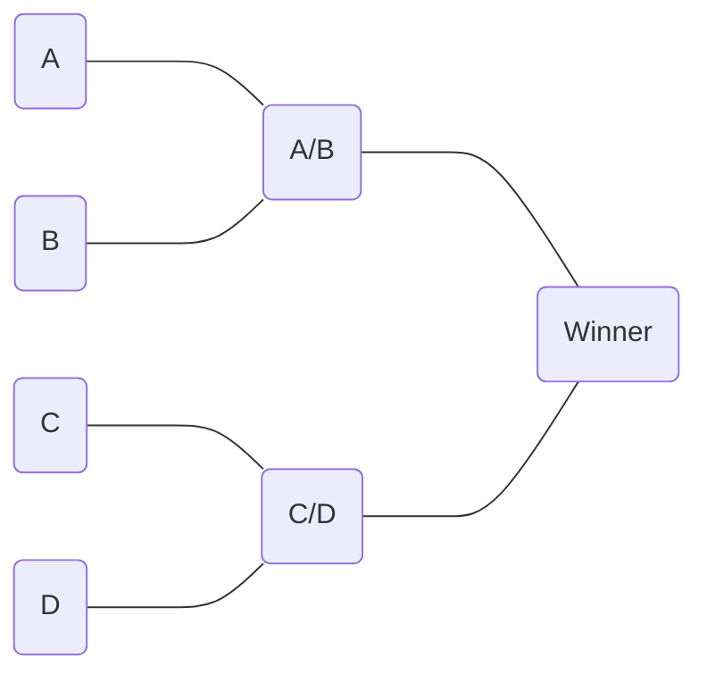

# Competition Tracker C# Application using WinForm UI

### _Description:_

> Design and deploy a C# windows based application which generates a single-elimination style matchup. The idea is to create an app to track a competition's progress, each competition consists of teams and prizes. Each team consists of 1 or more people depending on the type of sport. The app will allow us to match up those people into rounds and choose the winner. The data for each model (competition, people, teams, matchups etc) is stored in the database and text files.

---

### _Technology Utilized:_

*   [x] WinForm application
*   [x] Class Library
*   [x] SQL Database
*   [x] Text File Storage
*   [x] Dapper
*   [x] Linq
*   [x] Interfaces
*   [x] Emailing from C#
*   [x] Custom Events
*   [x] Advanced Debugging

---

### _Design:_

> **Structure:** Windows Forms application and Class Library
> 
> **Data:** SQL and/or Text File
> 
> **Users:** One client layer at the time

### _Key Concepts:_

<table><tbody><tr><td>Email</td><td>Interfaces</td></tr><tr><td>SQL</td><td>Random Ordering</td></tr><tr><td>Custom Events</td><td>Texting</td></tr><tr><td>Error Handling</td><td>User Testing</td></tr></tbody></table>
