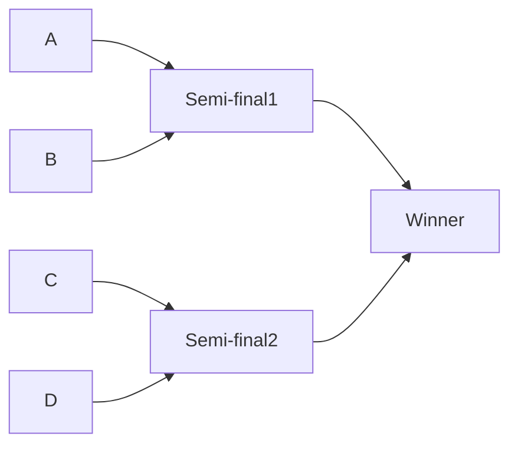

# Competition Tracker C# Application using WinForm UI

#### Description:

Design and deploy a C# windows based application which generates a single-elimination style matchup.

---

Technology Utilized:

*   [x] WinForm application
*   [x] Class Library
*   [x] SQL Database
*   [x] Text File Storage
*   [x] Dapper
*   [x] Linq
*   [x] Interfaces
*   [x] Emailing from C#
*   [x] Custom Events
*   [x] Advanced Debugging

---
